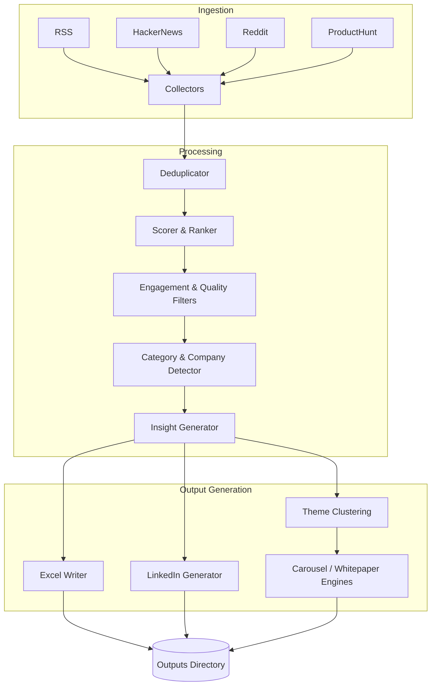

# System Architecture

The Agentic News Engine is built as a sequential, multi-stage data pipeline designed to ingest, process, and publish news content efficiently.

## Core Components

### 1. Configuration (`config/`)
Provides the dynamic parameters needed across the pipeline:
- `portals.json`: Defines the sources (RSS, HackerNews, Reddit, ProductHunt) to pull data from.
- `keywords.json`: Lists important terms for scoring and categorizing content.
- `quality_modes.json`: Configurations that set the thresholds for what constitutes a "high quality" update.
- `theme_clustering.json`: Rules for grouping related news items.

### 2. Collectors (`collectors/`)
The ingestion layer responsible for connecting to external sources:
- `api_collector.py`: Connects to authenticated APIs (like ProductHunt) to pull recent posts.
- `hackernews_collector.py`: Scrapes/pulls data from Y Combinator's HackerNews.
- `reddit_collector.py`: Ingests data from specified subreddits.
- `rss_collector.py`: Parses RSS feeds to extract structured articles.

### 3. Utilities & Processors (`utils/`)
The core intelligence and data processing layer:
- **`deduplicator.py`**: Identifies and merges overlapping/duplicate articles using token-set fuzzy matching.
- **`category_classifier.py`**: Assigns predefined categories (e.g., funding, product launch) to articles.
- **`company_detector.py`**: Identifies mentions of key companies (e.g., Anthropic, OpenAI).
- **`scorer.py` & `source_ranker.py`**: Heuristics to assign an importance score to the article based on its content, source authority, and current quality mode.
- **`insight_generator.py`**: Distills the article's summary into "Why It Matters", "SaaS Impact", and "PM Perspective".
- **`theme_clustering.py`**: Groups processed articles into cohesive themes.

### 4. Engines & Generators (`engines/`, `generators/`)
The formatting and output layer:
- **`carousel_generator.py` / `carousel_pdf_generator.py`**: Assembles the processed articles and themes into PDF presentations or carousel slide data.
- **`linkedin_generator.py` (via `utils/`)**: Translates article insights into formatted, social-media-ready Markdown drafts.
- **`whitepaper_generator.py`**: Compiles deep-dive reports.
- **`excel_writer.py` (via `utils/`)**: Exports the finalized dataset to `.xlsx` for manual review.

## Data Flow Diagram

## Module Relationships
- **`main.py`** acts as the orchestrator. It uses `concurrent.futures.ThreadPoolExecutor` to run collectors asynchronously.
- After gathering all raw articles, `main.py` passes the collective batch to `deduplicator.py`.
- Filtered articles are piped sequentially through the detection, scoring, and insight generation scripts within the `utils/` folder.
- Finally, the fully processed array of articles is passed to the output generators to yield the final `.xlsx`, `.md`, and `.pdf` files.
